# Managing VirtualMachines with GitOps

This repository contains instructions and files for a demonstration
deployment that shows how a CI/CD workflow of [`VirtualMachines`](https://kubevirt.io/user-guide/)
across multiple clusters could look like. It works with Open Cluster Management,
ArgoCD and KubeVirt or Red Hat Advanced Cluster Management, OpenShift GitOps 
and OpenShift Virtualization.

## What is Open Cluster Management or Red Hat Advanced Cluster Management?

Open Cluster Management (OCM) or Red Hat Advanced Cluster Management (ACM)
simplifies the management of multiple clusters by offering end-to-end
management, visibility and control of the whole cluster and application life
cycle. It acts as a central point for keeping an inventory of all your clusters
and applications and enables multi-cluster and multi-cloud scenarios, such as
deploying the same application across clusters in different regions, possibly on
several cloud providers. It uses a hub and spoke architecture and allows the
targeted distribution of Kubernetes manifests across clusters.

### What are hub and managed clusters?

The hub cluster is the cluster on which OCM/ACM is running on. It
acts as an inventory and carries out all management actions. It is usually not
running any actual workloads (though still possible), these run on managed
clusters. Managed clusters are kept in the inventory of the hub cluster.
Existing clusters can be added to the inventory and on ACM they can also be
created directly. The terms Open Cluster Management and Advanced Cluster
Management might be used interchangeably in the following sections. For more
information have a look at the [OCM documentation](https://open-cluster-management.io/concepts/architecture/#overview).

## What is the GitOps way and what is ArgoCD or OpenShift GitOps?

The GitOps way uses Git repositories as a single source of truth to deliver
infrastructure as code. Automation is employed to keep the desired and the live
state of clusters in sync at all times. This means any change to a repository
is automatically applied to one or more clusters while changes to a cluster will
be automatically reverted to the state described in the single source of truth.

ArgoCD or Red Hat OpenShift GitOps enables declarative GitOps workflows and
allows to deploy applications on-demand. It monitors the live state of clusters
against the desired state in a Git repository and keeps them in sync. The terms
ArgoCD and OpenShift GitOps might be used interchangeably in the following
sections. For more information have a look at
the [ArgoCD documentation](https://argo-cd.readthedocs.io/en/stable/#what-is-argo-cd).

### A quick primer about Applications and ApplicationSets

The ArgoCD `Application` is a [`CustomResourceDefinition` (CRD)](https://kubernetes.io/docs/concepts/extend-kubernetes/api-extension/custom-resources/),
which essentially describes a source of manifests and a target cluster to apply
the manifests to. Besides that, options like automatic creation of namespaces
or the automatic revert of changes can be configured.

The ArgoCD `ApplicationSet` is a CRD building on ArgoCD `Applications`,
targeted to deploy and manage `Applications` across multiple clusters while
using the same manifest or declaration. It is possible to deploy multiple
`ApplicationSets` which are contained in one monorepo. By using generators
it is possible to dynamically select a subset of clusters available to ArgoCD to
deploy resources to.

In this demo we are going to use `ApplicationSets` to deploy KubeVirt or
OpenShift Virtualization and `VirtualMachines` to multiple clusters while using
the same declaration of resources for all clusters.

For more information on `ApplicationSets` see the [documentation](https://argo-cd.readthedocs.io/en/stable/operator-manual/applicationset).

## Requirements for the setup

The following requirements need to be satisfied to build the setup described
in this demo yourself:

- A Git repository accessible by the hub cluster
- One Kubernetes or OpenShift cluster acting as hub cluster
    - Needs to be publicly accessible or at least accessible by the managed
      clusters
- One or more Kubernetes or OpenShift clusters acting as managed clusters
    - Can be in private networks
    - Virtualization has to be available
    - Nested virtualization is fine for demonstration purposes

### Repository preparation

You need to clone this repository to somewhere where you are able to make
changes to it (i.e. forking it on GitHub). Then open a terminal on your machine,
check out the repository locally and change your working directory into the
cloned repository.

The `ApplicationSets` in this repository use the URL of this repository as
`repoURL`. To be able to make changes to your `ApplicationSets`, you need to
adjust the `repoURL` to the URL of your own repository. If you do this later
do not forget to update any existing `ApplicationSets` on your hub cluster.

## Kubernetes specifics

The following sections will cover the Kubernetes specific part of this demo.

### Installing Open Cluster Management on the hub cluster

See the [OCM documentation](https://open-cluster-management.io/getting-started/installation/start-the-control-plane/)
on how to install Open Cluster Management.

Make sure to install [multicloud-integrations](https://github.com/open-cluster-management-io/multicloud-integrations)
for integration with ArgoCD too.

### Adding managed clusters to OCM on the hub cluster

See the [OCM documentation](https://open-cluster-management.io/getting-started/installation/register-a-cluster/)
on how to add managed clusters to OCM.

### Organizing managed clusters in a set on OCM

Managed clusters can be grouped into `ManagedClusterSets`. These sets can be
bound to namespaces with a `ManagedClusterSetBinding` to make managed clusters
available in the bound namespaces.

To add managed clusters to a new set see the [OCM documentation](https://open-cluster-management.io/concepts/managedclusterset/).
Make sure to name your set `managed` for compatibility with the manifests in
this repository.

Now we have a `ManagedClusterSet` that can be used to make the managed clusters
available to ArgoCD.

### Installing ArgoCD on the hub cluster

See the [ArgoCD documentation](https://argo-cd.readthedocs.io/en/stable/getting_started/)
on how to install ArgoCD.

## OpenShift specifics

The following sections will cover the OpenShift specific part of this demo.

### Installing Advanced Cluster Management on the hub cluster


1. Login as cluster administrator on the UI of the hub cluster
2. Open the `Administrator` view if it is not already selected
2. In the menu click on `Operators` and open `OperatorHub`
3. In the search type `Advanced Cluster Management for Kubernetes` and click
   on it in the results
4. Click on `Install`, keep defaults and click on `Install` again
5. Wait until `MultiClusterHub` can be created and create it
6. Wait until the created `MultiClusterHub` is ready (`Operators` -->
   `Installed Operators` --> see status of ACM)

### Adding managed clusters to ACM on the hub cluster

Managed clusters can be added to ACM in two ways:

1. Create a new cluster with ACM
2. Add an existing cluster to ACM

> Note: For the sake of simplicity we will let ACM create the managed clusters
> in this blog post on a public cloud provider. Please note that nested
> virtualization is not supported in production deployments.

To create one or more managed clusters follow these steps:

1. Login as cluster administrator on the UI of the hub cluster
2. At the top of the menu select `All Clusters` (`local-cluster` should be
   selected initially)
3. Add credentials for you cloud provider by clicking on `Credentials` in
   the menu and then clicking on `Add credentials`
4. Click on `Infrastructure` and then on `Clusters` in the menu
5. Click `Create cluster`, select your cloud provider and complete the
   wizard (use the default cluster set for now)

> Note: When using Azure as cloud provider select instance type
> `Standard_D8s_v3` for the control plane and `Standard_D4s_v3` for the worker
> nodes, resources might become to tight to run virtual machines on the
> cluster otherwise.

### Organizing managed clusters in a set on ACM

Managed clusters can be grouped into `ManagedClusterSets`. These sets can be
bound to namespaces with a `ManagedClusterSetBinding` to make managed clusters
available in the bound namespaces.

To add managed clusters to a new set follow these steps:

1. Login as cluster administrator on the UI of the hub cluster
2. At the top of the menu select `All Clusters` (`local-cluster` should be
   selected initially)
4. Click on `Infrastructure` and then on `Clusters` in the menu
3. Click on `Cluster sets` and then on `Create cluster set`
4. Enter `managed` as name for the new set and click on `Create`
5. Click on `Managed resource assignments`
6. Select all clusters you want to add, click on `Review` and then on `Save`

Now we have a `ManagedClusterSet` that can be used to make the managed clusters
available to ArgoCD.

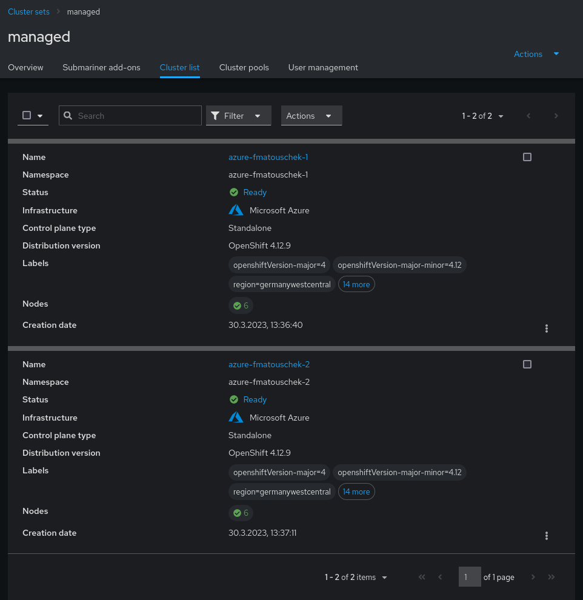

If done correctly, the cluster list of the created `ManagedClusterSet` in ACM
should look like in the screenshot above.

### Installing OpenShift GitOps on the hub cluster


1. Login as cluster administrator on the UI of the hub cluster
2. Open the `Administrator` view if it is not already selected
2. In the menu click on `Operators` and open `OperatorHub`
3. In the search type `Red Hat OpenShift GitOps` and click
   on it in the results
4. Click on `Install`, keep defaults and click on `Install` again
6. Wait until OpenShift GitOps is ready (`Operators` -->
   `Installed Operators` --> see status of OpenShift GitOps)

If installed correctly, the list of installed operators on your cluster should
look like in the following screenshot:

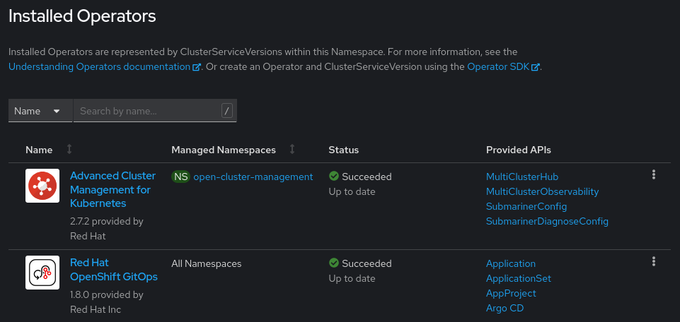

#### Accessing the OpenShift GitOps web UI

The OpenShift GitOps web UI is exposed with a `Route`. To get the
exact URL of the `Route` follow these steps:

1. Login as cluster administrator on the UI of the hub cluster
2. Open the `Administrator` view if it is not already selected
3. In the menu click on `Networking` and open `Routes`
4. In the `Projects` drop down select `openshift-gitops`
   (enable `Show default projects` if not visible)
5. There will be a `Route` called `openshift-gitops-server`, the location of
   this `Route` is the URL to the GitOps UI
6. You can log in to the GitOps UI with your OpenShift credentials

Alternatively you can use the command line to get the URL to the GitOps UI with
the following command:

```shell
oc get route -n openshift-gitops openshift-gitops-server -o jsonpath='{.spec.host}'
```

## Making a set of managed clusters available to ArgoCD or OpenShift GitOps

To make a set of managed clusters available to ArgoCD or OpenShift GitOps, a
tight integration between OCM and ArgoCD or ACM and GitOps exists. The
integration is controlled with the `GitOpsCluster` CRD.

Follow these steps to make the managed clusters available to ArgoCD or GitOps:

1. Make sure you are logged in to your cluster on the CLI
2. Run the copied command in your terminal
3. Create a `ManagedClusterSetBinding` in the `argocd` or `openshift-gitops`
   namespace to make the `ManagedClusterSet` available in this namespace
    - See file [managedclustersetbinding.yaml](acm-gitops-integration/managedclustersetbinding.yaml)
    - On Kubernetes run `kubectl create -n argocd -f acm-gitops-integration/managedclustersetbinding.yaml`
    - On OpenShift run `oc create -n openshift-gitops -f acm-gitops-integration/managedclustersetbinding.yaml`
4. Create a `Placement` to let OCM/ACM decide which clusters should be made
   available to GitOps
    - See file [placement.yaml](acm-gitops-integration/placement.yaml)
    - On Kubernetes run `kubectl create -n argocd -f acm-gitops-integration/placement.yaml`
    - On OpenShift run `oc create -n openshift-gitops -f acm-gitops-integration/placement.yaml`
    - For the sake of simplicity this will select the whole`ManagedClusterSet`,
      but advanced use cases are possible
5. Create a `GitOpsCluster` to finally make the selected clusters available to
   GitOps on the hub cluster
    - For Kubernetes see file [k8s-gitopscluster.yaml](acm-gitops-integration/k8s-gitopscluster.yaml)
    - On Kubernetes run `kubectl create -f acm-gitops-integration/k8s-gitopscluster.yaml`
    - For OpenShift see file [gitopscluster.yaml](acm-gitops-integration/gitopscluster.yaml)
    - On OpenShift run `oc create -f acm-gitops-integration/gitopscluster.yaml`

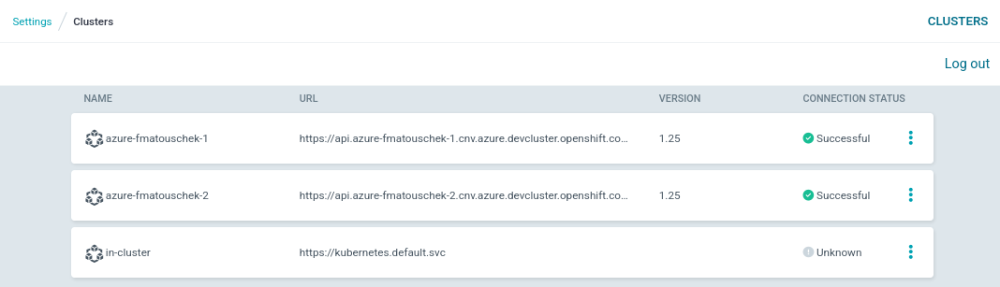

In this screenshot you can see that the managed clusters were made available to
ArgoCD successfully. This view can be opened by going to ArgoCD's settings and
opening the `Clusters` menu. Until an `Application` is deployed to the cluster
its connection status may still be `Unknown`.

## Assigning clusters to environments

In our setup we assign managed clusters to specific environments by setting a
label on them. Ideally it would be possible to assign them from OCM/ACM, but
for the time being this still has to be done in ArgoCD. In an upcoming OCM/ACM
release it will be possible to carry over labels set in OCM/ACM to ArgoCD.

See [this PR](https://github.com/open-cluster-management-io/multicloud-integrations/pull/51)
for details.

In this post we will work with the `dev` and the `prod` environments. Add your
managed clusters to the environments by following these steps:

Open ArgoCD's settings and open the `Clusters` menu. Then click on the three
dots on the right side of a cluster to edit it. After editing the cluster do not
forget to save your changes.

### Assigning clusters to the dev environment

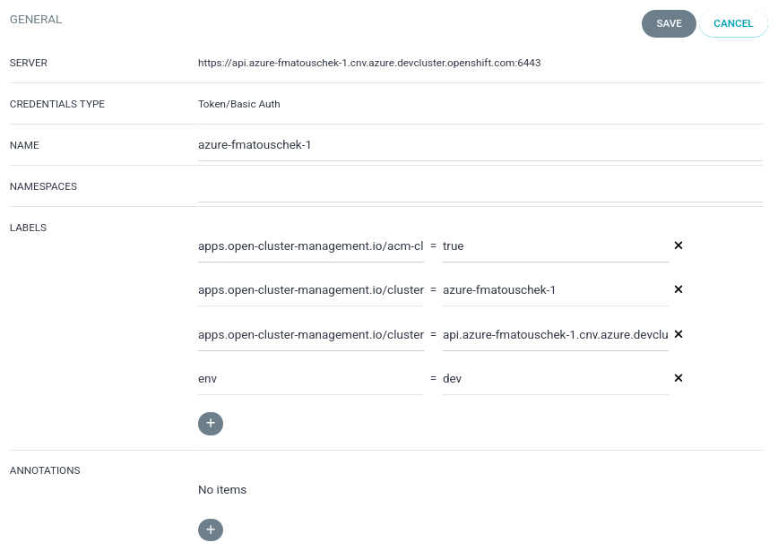

One or more of the clusters should belong to the `dev` environment. This is
achieved by setting the `env` label to the value `dev` on the managed cluster.

### Assigning clusters to the prod environment


One or more of the clusters should belong to the `prod` environment. This is
achieved by setting the `env` label to the value `prod` on the managed cluster.

## Deploying KubeVirt or OpenShift Virtualization to the managed clusters

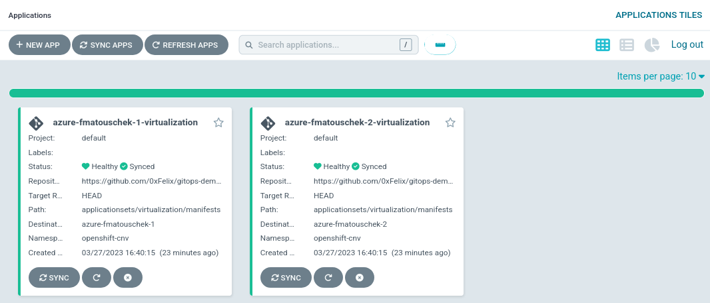

To deploy KubeVirt or OpenShift Virtualization to the managed clusters with
the help of an `ApplicationSet` run the following command from your cloned
repository (See [Repository preparation](#Repository-preparation)):

On Kubernetes run the following commands:

```shell
kubectl create -f applicationsets/cdi/applicationset-cdi.yaml
kubectl create -f applicationsets/kubevirt/applicationset-kubevirt.yaml
```

On OpenShift run the following command:

```shell
oc create -f applicationsets/virtualization/applicationset-virtualization.yaml
```

This will create an `Application` for each managed cluster that deploys
KubeVirt or OpenShift Virtualization with its default settings. The
`Application` will ensure that the appropriate namespaces exists, and it
will automatically apply any changes to this repository or undo changes
which are not in this repository. Sync waves are used to ensure that
resources are created in the right order.

### Order of resource creation on Kubernetes

1. `Namespace`, `CustomResourceDefinition`, `ClusterRole`
2. `ServiceAccount`, `Role`, `ConfigMap`
3. `ClusterRoleBinding`, `RoleBinding`
4. `Deployment`
5. `CDI` CR, `KubeVirt` CR

### Order of resource creation on OpenShift

1. `OperatorGroup`
2. `Subscription`
3. `HyperConverged`

Because the `HyperConverged` CRD is unknown to ArgoCD, the sync option
`SkipDryRunOnMissingResource=true` is set to allow ArgoCD to create a CR
without knowing its CRD.

### Forcing a specific version of OpenShift Virtualization

There is only one update channel for OpenShift Virtualization (called
`stable`) so the appropriate version for the managed cluster is selected
automatically.

To force a specific version from the channel do the following:

1. Make sure that [`grpcurl`](https://github.com/fullstorydev/grpcurl) and
   [`jq`](https://stedolan.github.io/jq/) are available on your machine
2. Extract the available [`CSV`](https://olm.operatorframework.io/docs/concepts/crds/clusterserviceversion/)
   versions from the Operator registry
    1. Login to the command line of the managed cluster
    2. Run
       `oc port-forward service/redhat-operators -n openshift-marketplace 50051:50051`
    3. In a separate terminal run
       `grpcurl -plaintext localhost:50051 api.Registry/ListBundles | jq 'select(.csvName | match ("kubevirt-hyperconverged-operator")) | .version'`
3. Set the following fields in the `Subscription` spec
    - `installPlanApproval`: `Manual`
    - `startingCSV`: Your desired and available CSV version

This technique can for example be used to control the upgrade process of
OpenShift Virtualization in a declarative way.

### Health state of an Application

In ArgoCD's UI you can follow the synchronization status of the newly created
`Application` for each cluster. Eventually every `Application` will reach the
healthy and synced status like in the following screenshot.

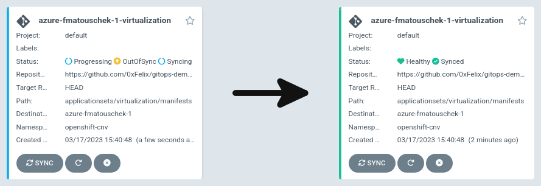

To see what is actually deployed have a look into the following directories:

On Kubernetes look into `applicationsets/cdi/manifests` and
`applicatioinsets/kubevirt/manifests`.

On OpenShift look into `applicationsets/virtualization/manifests`.

## Deploying a VirtualMachine to the managed clusters

To deploy a Fedora `VirtualMachine` on all managed clusters with the help of
an `ApplicationSet` run the following command from your cloned repository
(See [Repository preparation](#Repository-preparation)):

On Kubernetes run the following command:

```shell
kubectl create -n argocd -f applicationsets/demo-vm/applicationset-demo-vm.yaml
```

On OpenShift run the following command:

```shell
oc create -n openshift-gitops -f applicationsets/demo-vm/applicationset-demo-vm.yaml
```

This will create an `Application` for each managed cluster that deploys a
simple `VirtualMachine` on each cluster. It uses the Fedora `DataSource`
available on the OpenShift cluster by default to boot a Fedora cloud image.

On Kubernetes please create the DataSource with the following command:

```shell
kubectl create -f acm-gitops-integration/k8s-datasource.yaml
```

### Health state of the `Application`

Notice how the health state of the created `Application` is `Suspended`. This is
because the created `VirtualMachine` is still in stopped state.

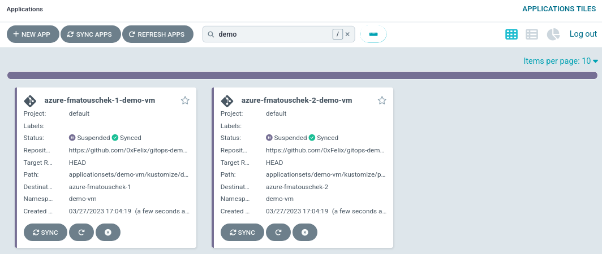

## Applying customizations to environments

Instead of using plain manifests this `ApplicationSet` is using `Kustomize`.
This allows to apply customizations to an `Application` depending on the
environment a managed cluster belongs to. In this post it is achieved by using
the `metadata.labels.env` value to choose the right `Kustomize` overlay.

The `dev` overlay prefixes names of created resources with `dev-`, while the
`prod` overlay prefixes names with `prod-`. Furthermore, the created
`VirtualMachines` get more or less memory assigned depending on the environment.
These are only simple customizations, but the possibilities are endless!

To see what is actually deployed have a look into the following directory:
`applicationsets/demo-vm/kustomize`.

### Quick summary

Here is a quick summary of the required steps:

1. Choose to modify all environments (`base`) or a single environment (eg.
   `dev` or `prod`)
2. To start the `VirtualMachine` in all environments edit
   `applicationsets/demo-vm/kustomize/base/virtualmachine.yaml`
3. Set `spec.running` to `true`
4. Commit and push the change to your repository
5. Refresh ArgoCD to pick up the change

The following sections will explain the steps in more detail.

### How to start or stop a VirtualMachine

First let us have a closer look at the `Application` of the stopped
`VirtualMachine`. Notice the `Suspended` health state. Also notice the `dev-`
prefix of the created `VirtualMachine`. It was created on a cluster belonging
to the `dev` environment.

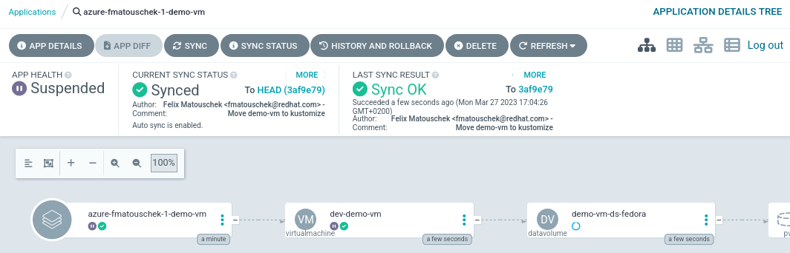

To start or stop a `VirtualMachine` you need to edit the `spec.running` field of
a `VirtualMachine` and set it to the corresponding value (`false` or `true`).
You can do this in the `applicationsets/demo-vm/kustomize` directory.

### Graceful shutdown of `VirtualMachines`

If the `VirtualMachine` has an appropriate termination grace period
(`spec.template.spec.terminationGracePeriodSeconds`), by setting this value to
`false` the `VirtualMachine` will be gracefully shut down. When setting the
timeout grace period to 0 seconds, the `VirtualMachine` is stopped immediately
however.

### Applying changes to specific environments

When modifying the `VirtualMachine` you can choose to either modify the base or
a specific overlay of `Kustomize`. This allows to start or stop the
`VirtualMachine` in every environment or just in a specific one. In this example
the `VirtualMachine` was started in every environment by modifying the
`Kustomize` base.

### Applying the change with ArgoCD

To apply new changes with ArgoCD you need to commit and push changes to the Git
repository containing your `Application`. To start or stop a `VirtualMachine`
you have to update the manifest and commit and push to your repository. In the
ArgoCD UI select the `Application` of the `VirtualMachine` and click `Refresh`
to apply the change immediately. Otherwise, it will take some time until ArgoCD
scans the repository and picks up the change.

### Observing the change

After ArgoCD picked up the change it will sync it to the `VirtualMachine` as
visible by the `Progressing` health state in the following screenshot:

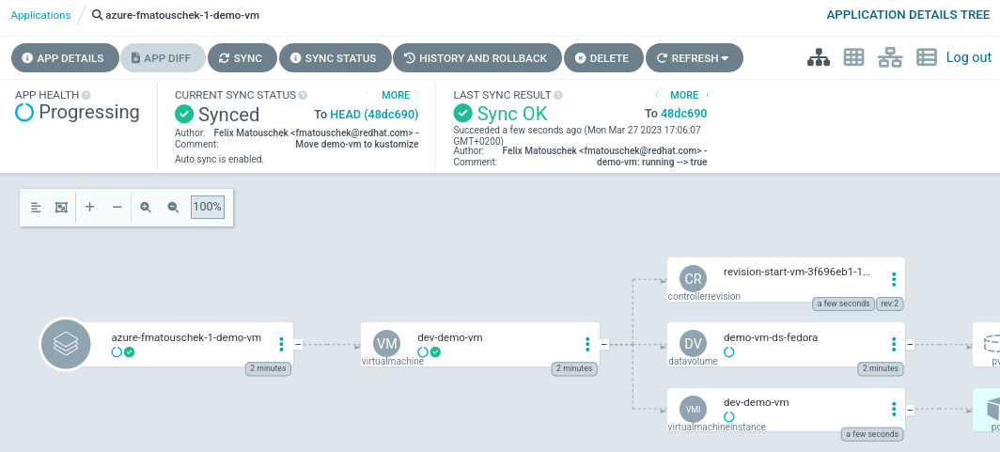

Eventually the `VirtualMachine` will be running and healthy:

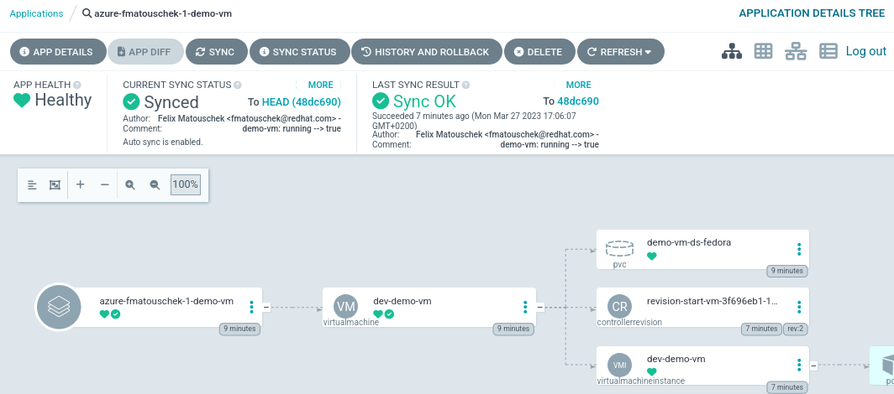

## Advanced usage of OCM/ACM Placements with ArgoCD or OpenShift GitOps

For the sake of simplicity the `Placement` created in this demo selects the
whole `ManagedClusterSet`, but more advanced use cases are possible.

OCM/ACM can dynamically select a subset of clusters from the `ManagedClusterSet`
while following a defined set of criteria. This for example allows to schedule
`VirtualMachines` on clusters with the most resources available at the time of
the placement decision.

For more on this topic see [Using the Open Cluster Management Placement for Multicluster Scheduling](https://cloud.redhat.com/blog/using-the-open-cluster-management-placement-for-multicluster-scheduling).

## Alternative way of deploying OpenShift Virtualization to managed clusters

An [OCM/ACM add-on](https://open-cluster-management.io/developer-guides/addon/)
that deploys OpenShift Virtualization to managed clusters was implemented
for evaluation purposes. The add-on is fully functional and can deploy
OpenShift Virtualization to all managed clusters that have a specific label set.

Although the add-on the serves the purpose of deploying OpenShift
Virtualization, it was found to be unnecessary complex when OpenShift GitOps
is available too. The add-on is only deploying a small set of static manifests
which can be deployed by GitOps too.

In contrast to its use stand the additional maintenance burden and resource
usage of another container running on the cluster. Therefore, it was decided
to not follow this path any further.

The add-on can be found [here](https://github.com/0xFelix/kubevirt-addon-manager).

## Integration with Ansible AWX or Ansible Automation Controller

OCM/ACM can be integrated with Ansible AWX or Ansible Automation Controller to
trigger Playbook runs after certain events. To make use of `VirtualMachines`
in Ansible a dynamic inventory is needed, which makes the `VirtualMachines`
available and accessible to Ansible.

There is already a collection of [KubeVirt modules](https://github.com/kubevirt/kubevirt-ansible/)
for Ansible, this collection however is deprecated and no longer working.

For evaluation purposes [a fork](https://github.com/0xFelix/kubernetes.kubevirt)
was created. This fork provides limited functionality but shows
that this type of integration is still possible. A demo of this Ansible
collection can be found [here](https://github.com/0xFelix/kubevirt-inventory-demo).

## Future use cases

A future use case is to pre-configure a `VirtualMachine` on a cluster and then
export it into a blob format which can be stored somewhere where it can be
accessed from other clusters. The blob could then be imported into other
clusters to allow deployment of replicas of a pre-configured `VirtualMachine`
across multiple clusters.

A possible blob format for this kind of export/import feature could be
[ContainerDisks](https://kubevirt.io/user-guide/virtual_machines/disks_and_volumes/#containerdisk),
which are already supported by KubeVirt or OpenShift Virtualization.

To show this is already possible with the current `ContainerDisk` implementation
a Proof-Of-Concept was created. The PoC can be found [here](https://github.com/0xFelix/kubevirt/tree/virtctl-exportcd).

## Summary and outlook

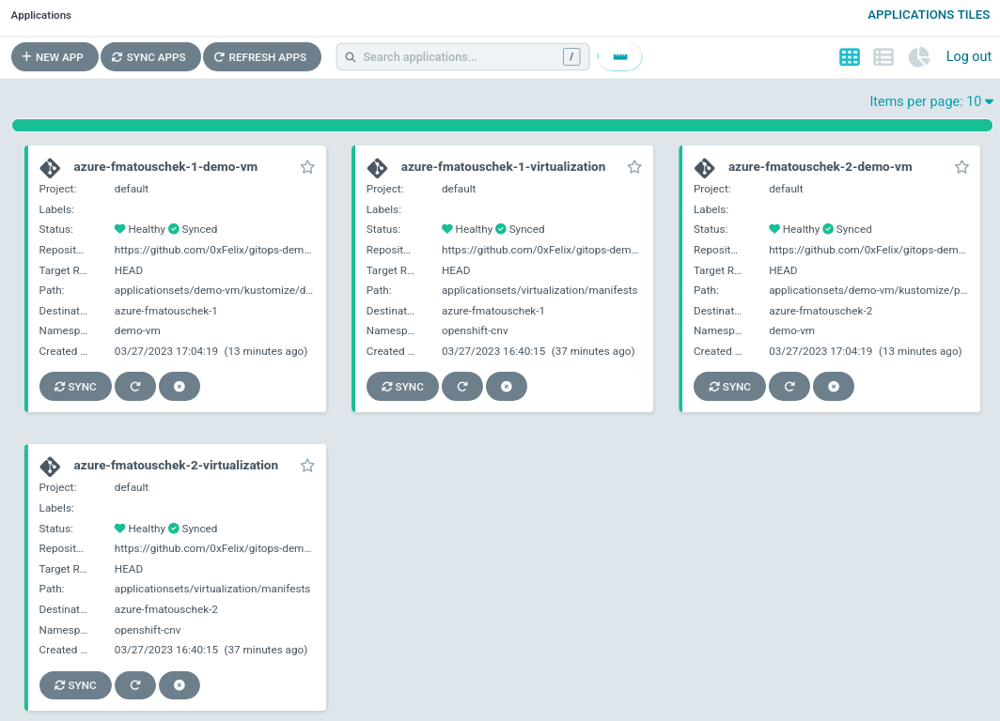

In this demo we set up a hub cluster and two clusters managed by OCM/ACM to
deploy applications to from a centralized management point. As example
applications we deployed KubeVirt or OpenShift Virtualization with simple
manifests and a virtual machine with manifests customized by `Kustomize`. We
learned how to apply customizations to specific environments and how we can
start and stop virtual machines in a declarative way. All of this was
accomplished the GitOps way by using a Git repository as a single source of
truth.

This is of course only the tip of the iceberg, building on this setup allows
you to customize your `ApplicationSets` for different environments like
development, staging and production or to schedule your applications based on
custom criteria (e.g. available resources) with advanced placements rules.